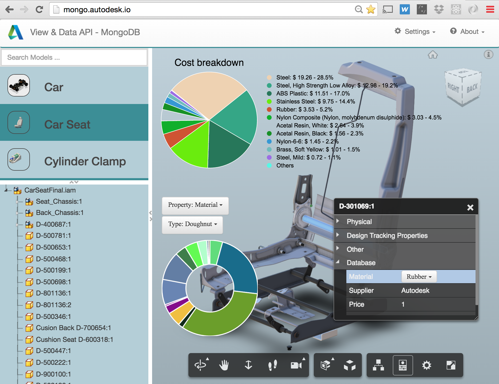
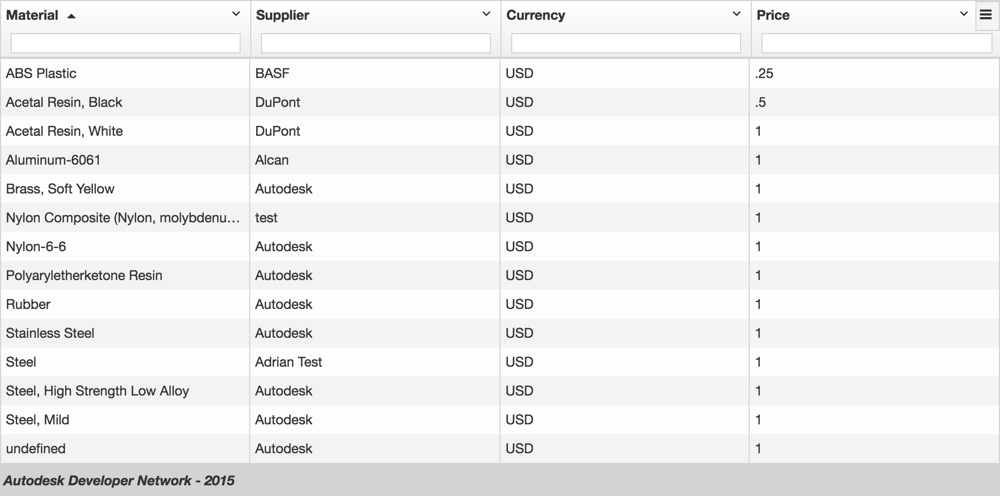

#Autodesk view and data API MongoDb Integration Sample

##Description

That sample demonstrates how to integrate MongoDb with the Autodesk View & Data API using a Node.js server and a AngularJs-based client

##Setup/Usage Instructions

* Install Node.js
* Run "npm install" command from the server directory
* Replace the place holder with your own credentials in credentials.js. You need to request credentials at our [developer portal](https://developer.autodesk.com/user/me/apps)
* To work as-is with the sample, you will need a model with components having a property named "ProductId", you can use the seat.dwf model from data folder
* Upload a model using instructions from the [API documentation](http://developer.api.autodesk.com/documentation/v1/vs/vs_quick_start.html#vs-api-quick-start)
* Alternatively you can use one of our tools, for example: [LMV Quick Start Guide](https://fast-shelf-9177.herokuapp.com/)
* Once you have translated successfully your model, place its URN in config-client.js
* This sample is using a sample mongodb hosted on [mongolab](https://mongolab.com/) which matches the model seat.dwf. [Mongolab](https://mongolab.com/) provides a free tier.
* You need to change to your own mongo database if you are using different models. Go to config-server.js, replace the access information of your mongoDb, you will need to be able to connect to a mongodb database, populated with products matching the "ProductId" of your model. The required fields on a product are: {ProductId, Name, SuplierName, Description, Currency, Price}
* Run the server: "node server.js" from command line
* Connect to server locally using a WebGL-compatible browser: http://localhost:3000/node/mongo.

## Live demo

[http://mongo.autodesk.io](http://mongo.autodesk.io)

## License

That samples are licensed under the terms of the [MIT License](http://opensource.org/licenses/MIT). Please see the [LICENSE](LICENSE) file for full details.

##Written by 

Written by [Philippe Leefsma](http://adndevblog.typepad.com/cloud_and_mobile/philippe-leefsma.html)

